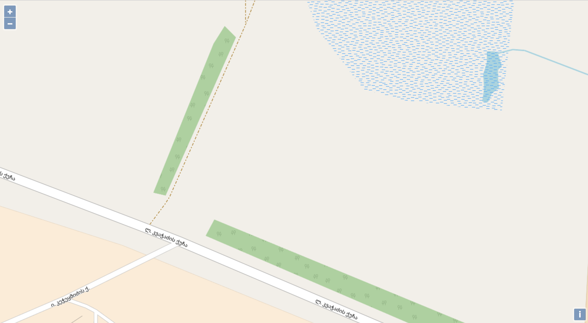
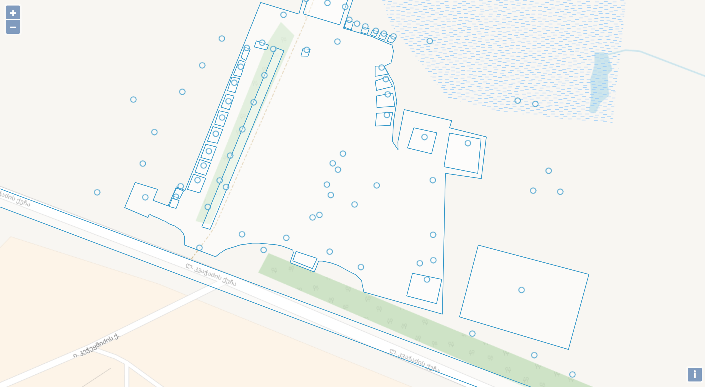
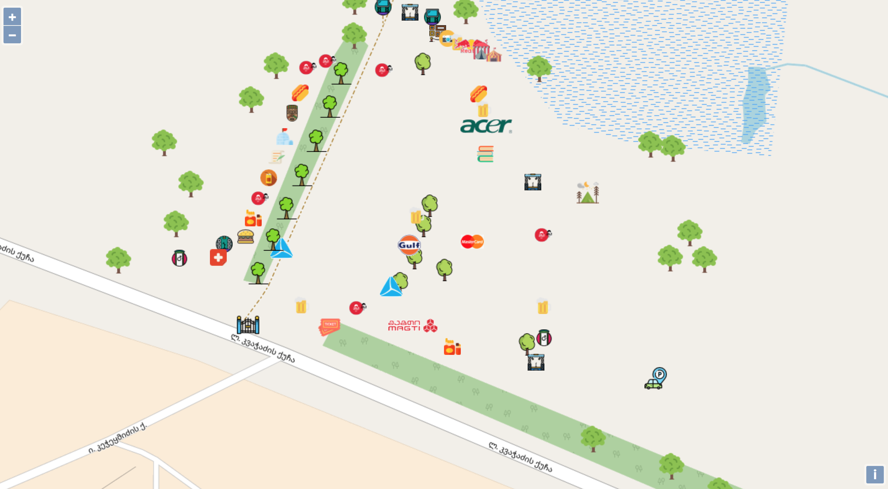
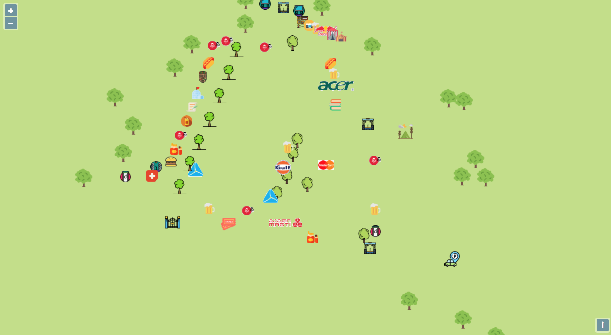
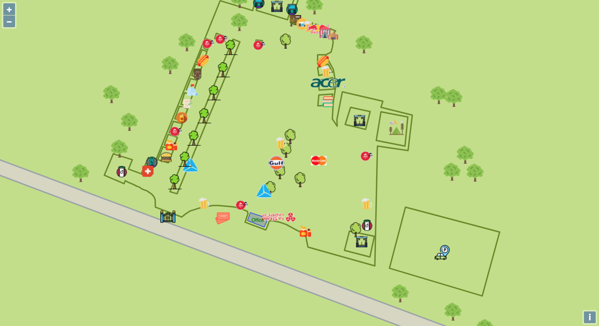
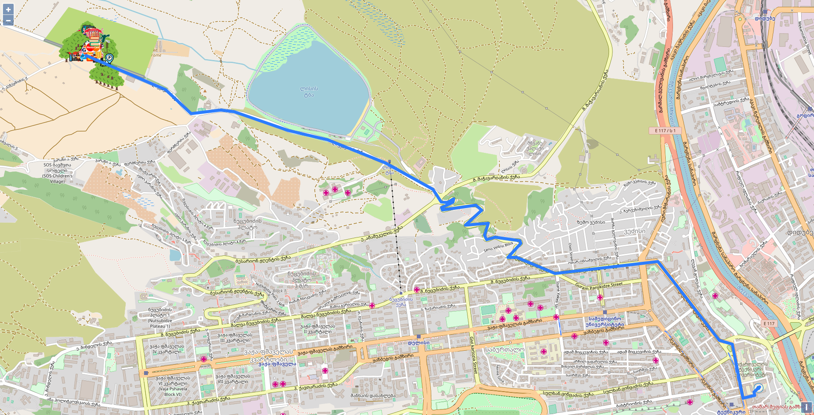

# js-final

Interactive map of Tbilisi OpenAir 2018

Development visualisation

1.Default_OSM_view.png

2.With_Openair_objects_without_style.png

3.After_icons_addition.png

4.After_background_grass_styling.png

5.After_road_and_boundary_styling.png

6.Routing.png
